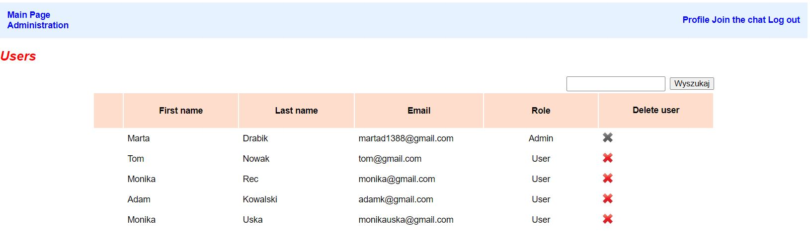
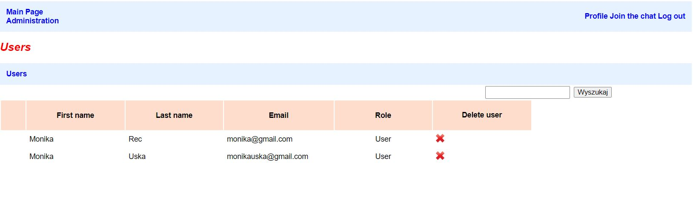
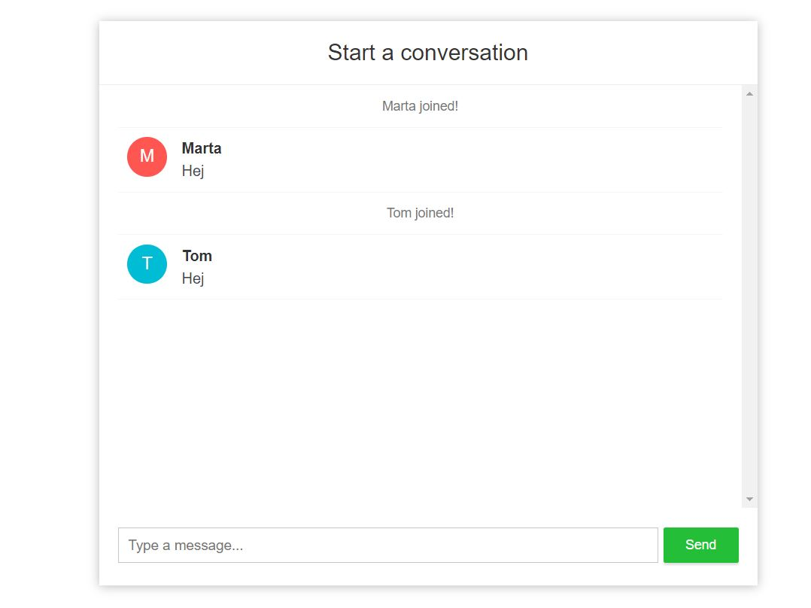

# chat-with-admin

## Table of contents
* [General info](#general-info)
* [Technologies](#technologies)
* [Screenshots](#screenshots)
* [Installation](#installation)
* [Status](#status)

## General info

This app allows:
- registration and login of new users
- conversations with other application users
- administrator login
- browsing the list of users
- user search
- deleting user
- log out

## Technologies
* [Spring Boot] - version 2.1.6
* [Thymeleaf]

## Screenshots

### Users List Page



### Search Page



### Chat with users



## Installation
This app is a Spring Boot application built using Maven. You can build a jar file and run it from the command line:

git clone https://github.com/martadrabik-dabrowska/users-chat
```sh
cd users-chat
./mvnw package
java -jar target/*.jar
```

You can then access app here: http://localhost:8099/

## Status
Project is: _in progress_

License
----

MIT


[Spring Boot]: <https://spring.io/projects/spring-boot>
[Thymeleaf]: <https://www.thymeleaf.org/>

